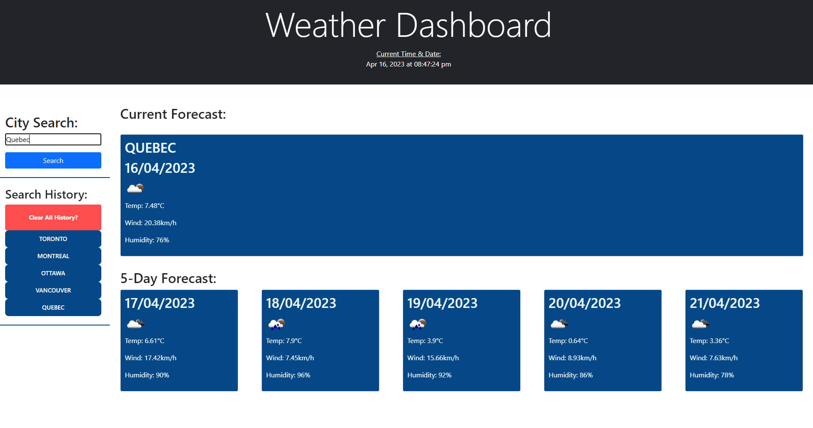

# Weather-Broadcast

## Description
A weather broadcasting website to show you the current and future forecast of any city of your choosing!  
It's very simple, all you have to do is type in the city you want to search and it will show you the current weather and 5 day-forecast in advance!  
It even saves your search history too for a quick and easy access. Even clear it if you want.  

## Links
**Deployed Link:** [Link to the deployed website!](https://heaveness.github.io/weather-broadcast/)  
**Github Repo:** [Link to Github repository!](https://github.com/Heaveness/weather-broadcast)  

## Previews
**Website:**  
  

## Credits

**Websites:** W3schools, stackoverflow, & reddit  
**Third-party APIs:** [Bootstrap](https://getbootstrap.com/), [jQuery](https://jquery.com/), [Day.js](https://day.js.org/), [Fontawesome](https://fontawesome.com/) [OpenWeatherMap](https://openweathermap.org/)  
**Instructor(s):** Ali Maqsood, Daler Singh  
**Assistant Instructor(s):** Shihan, Adam, Krishna, Tareque Moatar  
**Institution:** University of Toronto  